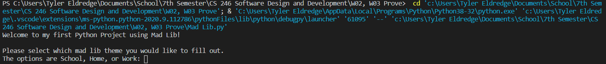

# Overview
My first three beginner level Python projects posted on Github. The three programs are:
* A simple Bank Account
* A simple Currency Converter
* A simple Mad Lib

# Development Environment

* Visual Studio Code
* Python 3.8.5

# Execution

To execute the Bank Account program: `python Bank_Account.py`

To execute the Currency Converter program: `python Currency_converter.py`

To execute the Mad Lib program: `python Mad_lib.py`

# Useful Websites

* [Python Refrence](https://docs.python.org/3/library/index.html)
